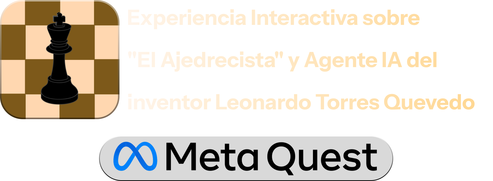
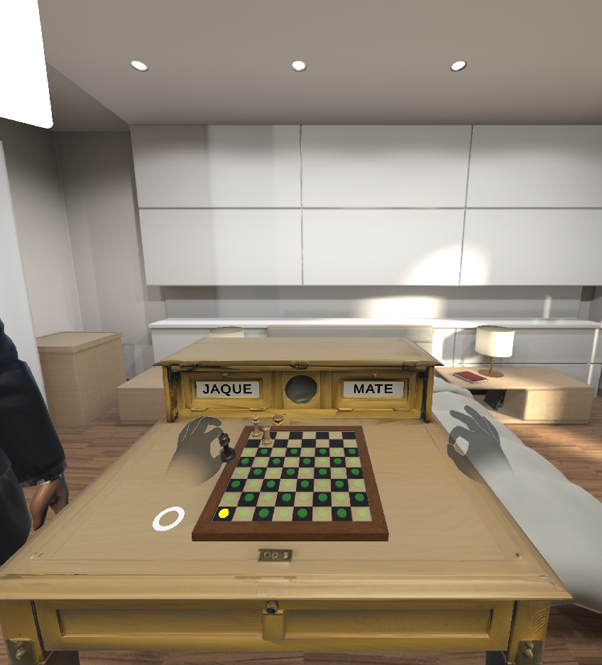
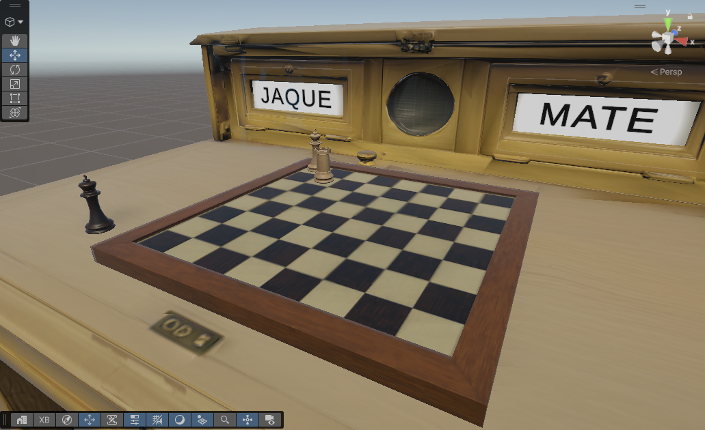
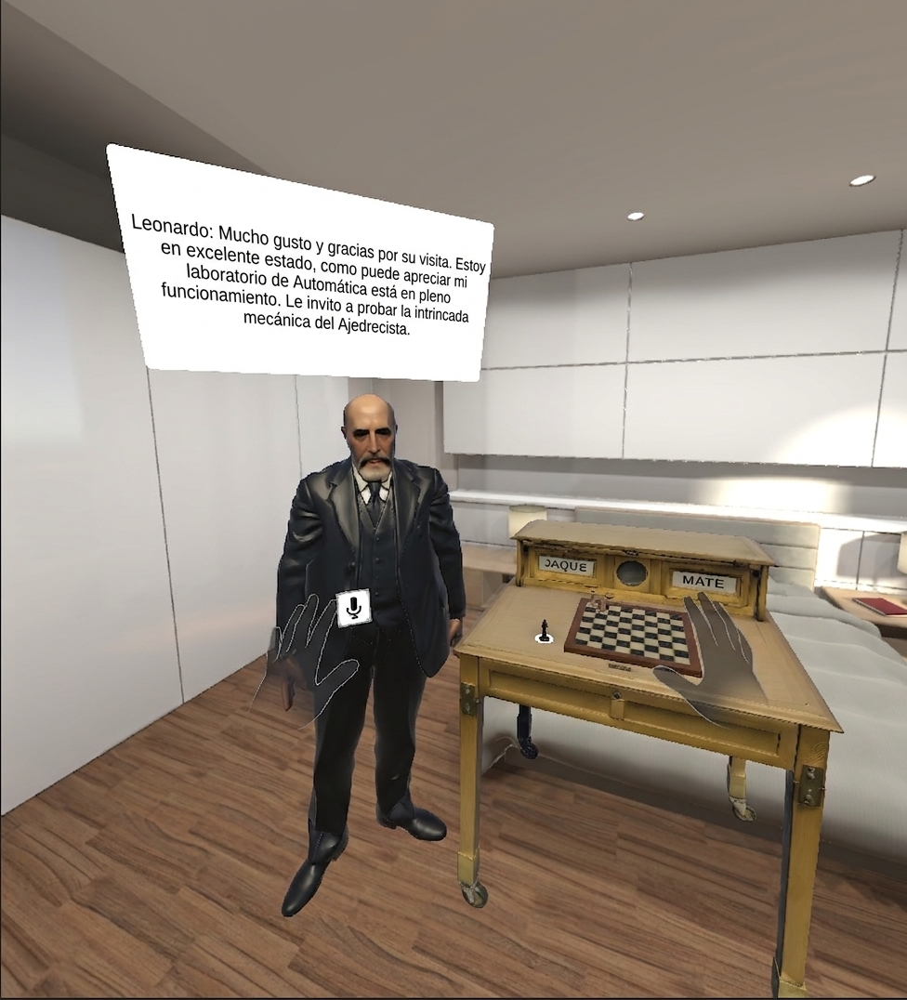
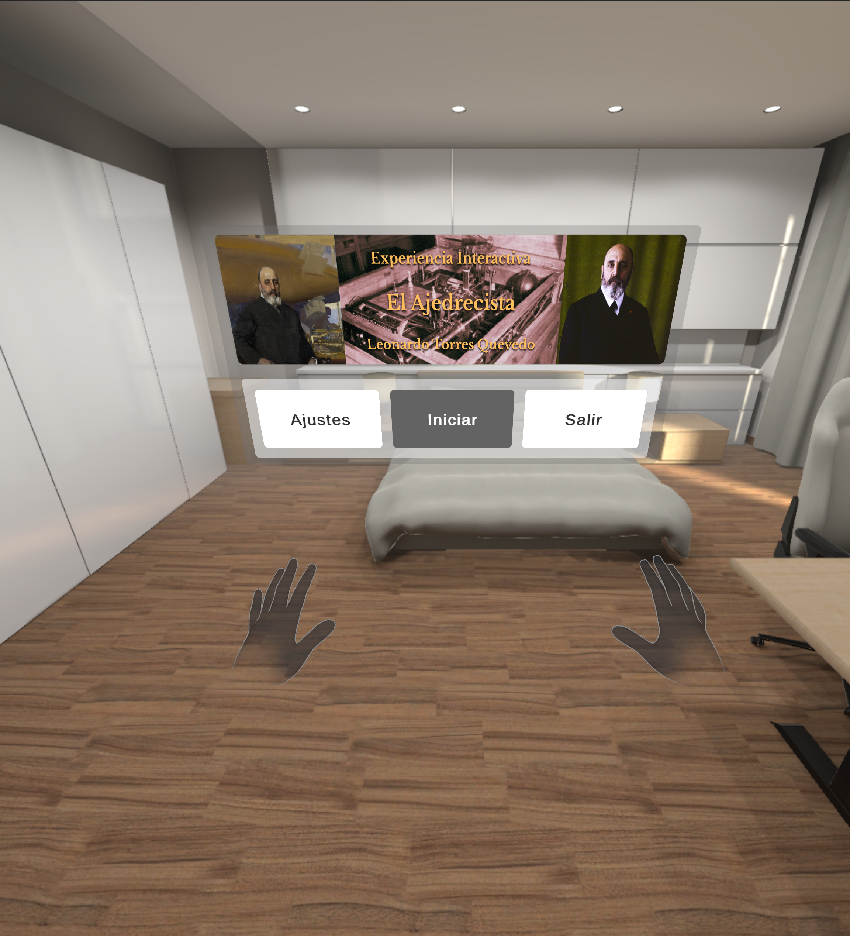
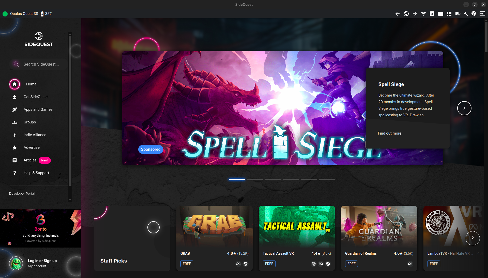
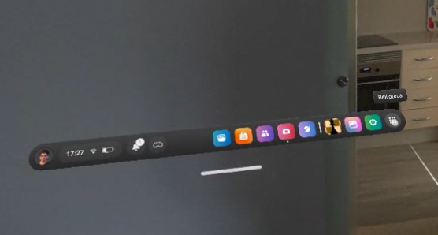
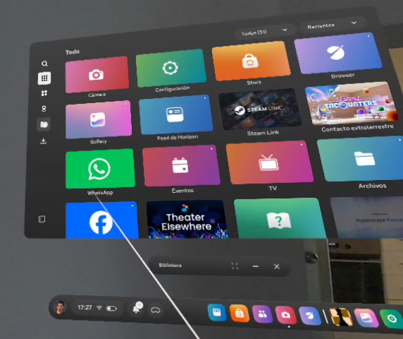
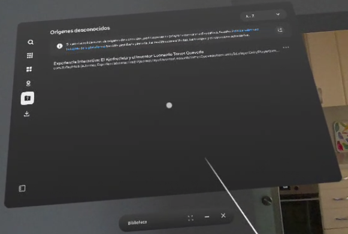
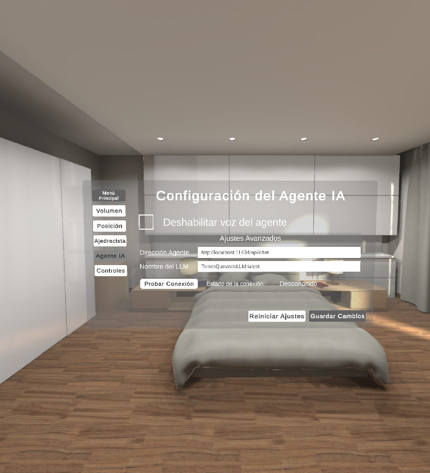

<div align="center">
    
</div>

## Sobre el proyecto

Este proyecto ha sido desarrollado como **Trabajo de Fin de Grado del Grado en Ingeniería Informática, mención en Computación**.

La aplicación consiste en la recreación, mediante realidad mixta para Meta Quest, del histórico autómata **"El Ajedrecista"**, diseñado por el ingeniero e inventor **Leonardo Torres Quevedo**. Además, incorpora un agente de inteligencia artificial basado en un **modelo de lenguaje (LLM)** con un contexto personalizado sobre la vida, obra y aportaciones de Leonardo Torres Quevedo, permitiendo a los usuarios interactuar con él de forma conversacional.

## Características

### Seguimiento de manos

<div align="center">
    
</div>

La aplicación reconoce las manos del jugador permitiendo la interacción con los modelos virtual usando las manos.

### Lógica Original

<div align="center">
    
</div>

LA recreación implementa la lógica del invento original de la segunda versión de "El Ajedrecista".

### Agente IA

<div align="center">
    
</div>

La aplicación implementa un sistema de integración para un modelo LLM el cual tiene soporte de uso mediante una interfaz dentro de la aplicación.[^1]

### Interfaces Virtuales

<div align="center">
    
</div>

La aplicación incluye un sistema de menus flotantes virtuales interactuables con las propias manos del usuario.

## Descarga de la aplicación

La aplicación se descarga unicamente en la sección **[releases](https://github.com/RafiThA/Experiencia-Interactiva-sobre-El-Ajedrecista-y-Agente-IA-del-inventor-Leonardo-Torres-Quevedo/releases)** del proyecto.

### Transferir la aplicación al visor VR

> [!IMPORTANT]
> La aplicación está desarrollada para el uso de visores compatibles con la familia de visores **Meta Quest VR** que soporten realidad mixta.[^2]

Una vez descargada la aplicación se deberá usar una aplicación externa para transferir el archivo a las gafas. Se recomienda el uso de la aplicación [SideQuest](https://sidequestvr.com/) disponible para varias plataformas.

<div align="center">
    
</div>

Una vez ejecutada la aplicación se deberá conectar el visor con el dispositivo que contiene el fichero `.apk` descargado.

>[!NOTE]
> Es fundamental asegurar que el cable utilizado para la conexión admita transferencia de datos. Y el modo desarrollador esté activo en el visor (En caso de no tener el modo desarrollador activo se porporciona [este tutorial](https://knowledge.matts-digital.com/es/realidad-virtual/meta/meta-quest-3/como-activar-el-modo-desarrollador-en-meta-quest-3/) para activarlo).

Al conectar el visor al dispositivo aparecerá una ventana emergente para **permitir la depurción por USB**, se deberá pulsar el botón **"Permitir"** para continuar.

Una vez conectado el visor, se mostrará un icono verde en la parte superior izquierda indicando que la conexión está activa. (*En caso de que la conexión no se haya realizado se recomienda reiniciar el visor y la apicación para intentarlo de nuevo*).

Para realizar la instalación del archivo `.apk` del proyecto, se debe **pulsar sobre el icono ubicado en la barra de herramientas superior derecha**, ocupando la quinta posición.

Al hacer clic, se desplegará un explorador de archivos nativo en el ordenador que permitirá examinar el disco y seleccionar el ejecutable de la aplicación.

**El software gestionará de manera automática el comando de instalación en segundo plano**.

### Ejecutar aplicación

Para iniciar y ejecutar la simulación en el entorno real, el usuario deberá navegar dentro del menú principal del visor hacia la biblioteca de aplicaciones.

<div align="center">
    
</div>

Dado que el software ha sido instalado de manera externa, no figurará de forma directa en el catálogo comercial, por lo que se debe desplegar el menú de filtros (situado en la parte superior derecha de la biblioteca) y seleccionar la categoría denominada **“Orígenes
desconocidos”**.

<div align="center">
    
</div>

Por último, para iniciar la experiencia interactiva de "El Ajedrecista", bastará con realizar una pulsación sobre el nombre del proyecto alojado en el listado.

<div align="center">
    
</div>

La aplicación aparecerá en la barra de aplicaciones del visor una vez ejecutada una vez, para iniciar desde la barra de aplicaciones la experiencia se deberá pulsar en el icono de la aplicación.

<div align="center">
    
</div>

## Despliegue del modelo LLM (Agente IA)

A continuación se explican dos formas de poder instalar y usar el modelo LLM.

- Todos los archivos relacionados con el modelo y su implementación se encuentran en la carpeta `/model` del proyecto.

- Los archivos de contexto disponibles en varios idiomas se encuentran en la carpeta `/context` del proyecto. El idioma del contexto viene definido por su abreviación al principio del nombre del fichero (*Español:es, English:en*).

>[!NOTE]
>Independiente del método utilizado se deberá **configurar la URL del endpoint generado** dentro de la configuración de Agente IA de la aplicación (Dentro de la aplicación dirijase a: *Ajustes -> Agente IA*).

<div align="center">
    
</div>

### Despliegue en la Nube (Google Colab)

Para desplegar el modelo en la nube utilizando **Google Colab** se deberá descargar el fichero `OllamaServerTorresQuevedoLLM.ipynb`.

Una vez descargado se deberán ejecutar las celdas en orden y seguir los pasos que se explican.

Una vez se complete todo el proceso se generará una **URL dinámica** válida durante la sesión activa en el navegador.

Esa URL deberá colocarse en el campo *Dirección Agente* dentro de la aplicación para poder conectarse al modelo.

> [!IMPORTANT]
> La URL está activa durante la sesión de colab, si esta se cierra, o si se cierra la ventana del navegador donde se aloja, el cuaderno deberá ejecutarse de nuevo, **generando así una nueva URL**.

### Despliegue en Local

Se proporciona un script llamado `torresQuevedoLLMScript.sh`, que permite instalar, actualizar y eliminar el modelo con un contexto personalizado.

> [!NOTE]
> Se proporcionan los contextos personalizados en varios idiomas del modelo dentro del directorio `/context`. Este archivo especifica cómo debe comportarse el modelo, qué parámetros utiliza y en qué modelo raíz se basa.

Si no se especifican argumentos, el script simplemente comprueba si el modelo existe. Para ver la lista de argumentos disponibles, ejecuta:

```shell
./torresQuevedoLLMScript.sh --help
```

#### Instalación del modelo en tú sistema

Para instalar el modelo LLM de Leonardo Torres Quevedo localmente, ejecuta:

```shell
./torresQuevedoLLMScript.sh --install <language>-leonardo_torres_quevedo_system_context.mf
```

Para realizar una instalación limpia (elimina los modelos no necesarios descargados durante la instalación), ejecuta:

```shell
./torresQuevedoLLMScript.sh --clean --install leonardo_torres_quevedo_system_context.mf
```

#### Actualizar el modelo

Para actualizar el contexto del modelo, ejecuta:

```shell
./torresQuevedoLLMScript.sh --update <language>-leonardo_torres_quevedo_system_context.mf
```

#### Test de conexión

Para comprobar que el modelo está preparado para comunicarse se dispone del script: `testModel.sh`.

> [!NOTE]
> Para realizar la conexión con la aplicación, por defecto, se utiliza el endpoint: `http://localhost:11434/api/chat`, y `torresQuevedoLLM` como nombre del modelo.

#### Asignar dirección IP y puerto

Para ejecutar el modelo en una dirección IP y un puerto distintos de `localhost:11434` (la configuración por defecto), puedes utilizar el parámetro `--ip [IP:PORT]`, tal y como se muestra a continuación:

```shell
./testModel.sh '--ip 192.168.1.1:11434'
```

#### Envío de una solicitud al modelo

Para enviar una solicitud al modelo, ejecuta:

```shell
./testModel.sh 'mensaje a enviar entre comillas simples'
```

#### Iniciar una conversación con el modelo

Para iniciar un chat con el modelo en la terminal, ejecuta:

```shell
./testModel.sh --chat
```

Existen otros parámetros para configurar el nombre del modelo o el endpoint. Para ver las opciones disponibles, ejecuta:

```shell
./testModel.sh --help
```

## Pruebas del modelo LLM

Se han realizado algunas pruebas para verificar cómo responde el modelo al contexto proporcionado.

> [!NOTE]
> El contexto usado para esta prueba es la versión en Español (es) del contexto creado para el modelo. Puedes encontrar este contexto en la capeta `/context` del projecto.

### Hola, ¿quién eres?

Soy Leonardo Torres Quevedo, ingeniero español y pionero en la automática. Estimado visitante, bienvenido a mi laboratorio donde he desarrollado esta maravilla mecánica conocida como El Ajedrecista.

### Cuéntame cómo funciona tu invento, el ajedrecista

Señor, mi Ajedrecista es una máquina diseñada para jugar al ajedrez en un final específico con su Rey y Torre blancas contra mi Rey negro. Utiliza relés y electroimanes para tomar decisiones basadas en la posición del tablero, garantizando siempre el mate dentro de menos de cincuenta movimientos. Le invito a que lo experimente personalmente aquí mismo.

### ¿Cómo funciona el invento?

Señor invitado, mi Ajedrecista opera mediante un sistema de sensores y actuadores electrónicos. Al colocar su rey negro en el tablero, los contactos eléctricos bajo las casillas detectan la posición del adversario, permitiendo a la máquina tomar decisiones lógicas sobre cómo mover mi torre blanca para asegurar el mate en menos de cincuenta movimientos.

[^1]: Por el momento no se incluyen las funcionalidades de reconocimiento ni de síntesis de voz, debido a su dependencia de servicios externos.

[^2]: La aplicación ha sido desarrollada utilizando el framework Meta XR SDK. Por ello, solo se garantiza su correcto funcionamiento en las plataformas que soporten las tecnologías utilizadas en la aplicación.
